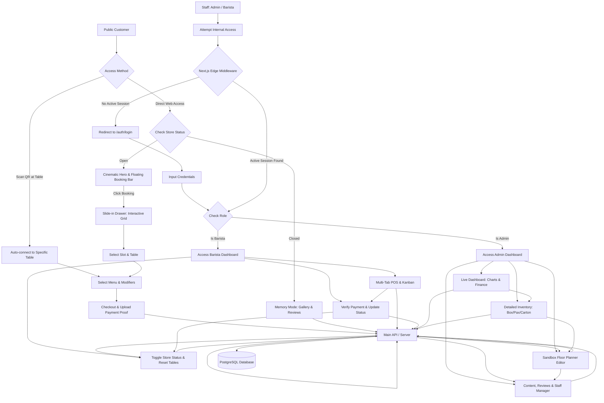

# PRD — Project Requirements Document: Multipurpose Hybrid Coffee Shop Ecosystem

## 1. **Overview**
This application is a hybrid web-based ecosystem platform for a single-tenant coffee shop. It seamlessly combines a cinematic public-facing website (featuring a dual-state mode), a complex Point of Sale (POS) system for cashiers, and an interactive sandbox floor planner for table layout management.

Primary problems solved:
- Long queues at the cashier area during rush hours.
- Human errors in manual order taking and custom modifiers (e.g., ice levels, sugar levels, or milk alternatives).
- The need for dynamic cafe layout management; this app provides a simulator-style sandbox grid layout system.
- Separation of operational workspaces: isolating backend management (Admin) from live order processing (Barista).
- Operational security: preventing unauthorized parties from accessing store data or functionalities simply by guessing URLs.
- Business analytics needs: owners struggle to track cafe performance, cash flow (income/outcome), and physical stock availability in detail.

Primary platform goals:
- Provide a luxury resort-scale public landing page (inspired by Ayana Resort Bali's UI/UX interactions) that features an "Open" mode (focused on interactive booking & ordering) and a "Closed" mode (focused on galleries, reviews, and cafe memories).
- Allow customers to place orders without logging in, both via *Online Booking* (reserving from home via web) and *Walk-in* (scanning a physical QR code at the table).
- Provide an Admin dashboard featuring a drag-and-drop floor planner to manage physical table layouts, alongside comprehensive analytics.
- Provide a fast Barista POS dashboard that supports multi-tab ordering and a live Kanban queue to verify manual payments in real-time.

## 2. **Requirements**
- The system is designed specifically for a single coffee shop business entity (Single-tenant).
- Clear domain routing separation: `/` for Customers, `/admin` for Managers/Owners, and `/barista` for Cashiers.
- **Access Security (Protected Routes):** The `/admin` and `/barista` URLs **cannot** be accessed merely by typing the domain. Direct access without a valid session will automatically be intercepted and redirected to the authentication page.
- The system implements strict Role-Based Access Control (RBAC); Baristas cannot alter menus/layouts, and Admins do not interfere with the live order queue. If a Barista attempts to access `/admin`, the system will deny access (Forbidden).
- The public landing page features a *Dual-State* mechanism: it visually transforms based on the store's status (Open/Closed), which is toggled by the Barista/Admin.
- Public customers can view an interactive floor plan, select tables (using **minimalist, thin-stroke line-art icons**), browse menus with dynamic badges, adjust custom modifiers (temperature, sugar, milk), and checkout without creating an account.
- The system must generate a unique QR Code for every table created in the Sandbox Grid, allowing walk-in customers to scan it and automatically connect to that specific table.
- Baristas have a "Reset All Tables" master button to instantly clear all table statuses at the end of a shift.
- Payments are handled manually (Bank Transfer/QRIS) where customers upload a proof of payment, and Baristas verify it via the POS dashboard.
- **Analytics & Detailed Inventory:** The admin dashboard must present real-time statistics, visitor/financial charts, and an inventory system with accurate units of measurement (e.g., pax, box, cartons).
- The system must be highly mobile-friendly for the Customer side, and optimized for Tablet/Desktop landscape on the Barista & Admin Dashboards.
- The MVP does not require an automated payment gateway.

## 3. **Core Features**
- **Secure Authentication Portal (`/auth/login`)**
  - A centralized authentication gateway page for internal staff.
  - Requires email and password.
  - *Smart Redirection*: Upon successful login, the system detects the user's role and routes them to the appropriate dashboard.

- **Dual-State Cinematic Landing Page (Ayana Resort Style UX)**
  - **Open Mode:** Displays a full-screen cinematic Hero Section (high-res video/photo with smooth scrolling transitions). The booking feature uses a *Floating Booking Bar* that, when clicked, reveals an elegant *slide-in drawer* UI for the Interactive Floor Plan.
  - **Closed Mode (Memory Mode):** The booking bar is hidden. The page transforms into an exhibition of moody cafe photo galleries, customer reviews, past events, and upcoming promos.
  - **Minimalist Iconography Engine:** The entire UI exclusively uses elegant, thin-line vector icons (e.g., Lucide) to maintain a melancholic, modern, and uncluttered aesthetic. 

- **Canonical Sandbox Floor Planner v2 (Central Table Management)**
  - **Single Source of Truth:** Operates as the central table management engine for the entire ecosystem (Admin, Barista, and Customer flows) rather than a visual layout editor. No module maintains an independent copy of table data.
  - **Infinite & Flexible Canvas:** High-performance viewport with continuous float coordinates (1200x800 base resolution), zoom/pan controls, optional snap-to-grid editing aid, magnetic snapping, and collision detection.
  - **Comprehensive Entity Support:** 7 table geometry shapes (*Square, Rectangle, Round, Oval, Bar Seat, Sofa, Private Room*) and 12 decorative architectural static objects (*Wall, Counter, Cashier, Kitchen, Plant, Window, Door, Decoration, Waiting Area, Restroom, Divider, Custom*).
  - **Advanced Editing Tools:** Move, rotate (90°/45°/free), resize handles, duplicate, delete, undo/redo stack (Ctrl+Z/Shift+Z), lock/unlock position, hide/show, and keyboard nudging (Arrow keys).
  - **Live Property Inspector:** Sidebar providing real-time edits to names, pax capacity, coordinates, dimensions, operational status, notes, and live active ticket monitoring.
  - **Layout Versioning & Snapshots:** Ability to create, duplicate, switch, and restore named floor plan snapshots (e.g., *Main Dining Room, Weekend Patio Setup, Evening Fine Dining*).
  - **Integrated QR Code Suite:** Automatic QR generation per table, walk-in testing URLs, bulk PNG downloads, and printable QR cards.

- **Menu & Guest Checkout Engine (Customer)**
  - Menu catalog with *Dynamic Badges* (Best Seller, Promo, Limited).
  - *Complex Modifier Modal*: Options for ice levels, sugar, milk types, and add-ons.
  - Quick checkout (Dine-in / Takeaway / Advance Booking) with manual payment proof upload.

- **Multi-Tab POS & Barista Dashboard (Barista)**
  - **Multi-Tab Interface:** Cashiers can open multiple concurrent orders in different tabs.
  - **Live Order Kanban:** Real-time queue board (*Pending Payment -> Paid & Preparing -> Ready to Serve -> Completed*).
  - **Payment Verification:** Feature to inspect the transfer receipt photos uploaded by customers.
  - **Store & Table Control:** Store Status toggle (Open/Closed) and Occupancy management (manual table clearing or "Reset All Tables").

- **Content Management, Analytics & Settings (Admin)**
  - **Live Overview:** Admins can monitor cafe operations in real-time (number of occupied vs. empty tables, active order queues).
  - **Advanced Analytics & Charts:** Data visualization via daily/monthly charts for visitor counts, *Income vs Outcome* reports, *Most Used Table* rankings, and *Top Selling Menu* items.
  - **Detailed Inventory Management:** Physical stock tracking using specific Units of Measurement (UoM: pcs, pax, box, cartons, grams, liters).
  - **Catalog & Content Management:** Manage products, categories, pricing, badges, gallery photos, event announcements, customer review moderation, and QRIS/Bank account info.
  - **Staff Account Manager:** Admins can create, edit, or revoke staff (Barista) account access.

## 4. **User Flow**

### Public Customer Flow 1: Book Online (Advance Web Booking)
*This flow adopts the luxury resort navigation experience (Ayana Style).*
1. Customer opens the cafe's root web domain and is greeted by a full-screen Cinematic Hero Section.
2. Customer clicks the floating booking bar ("Reserve Your Space") elegantly pinned to the screen.
3. A slide-in drawer UI containing the Interactive Floor Plan smoothly glides in from the side/bottom of the screen.
4. Customer clicks an *Available* table icon block (e.g., *Long Couch*), views capacity details, selects a date and time slot, and confirms the selection.
5. The drawer closes, and the customer is automatically directed to the menu catalog to select pre-order items (optional) and configure custom modifiers.
6. Customer proceeds to the checkout page, fills in basic personal details (Name, WhatsApp), and reviews the summary.
7. The system locks the table status to `booked` for that time slot, and the order is marked as `pending_payment`.
8. Customer views payment instructions, transfers the funds, and uploads the receipt photo. Once verified by the Barista, the reservation is officially approved.

### Public Customer Flow 2: Walk-in via Physical QR Code
1. Customer arrives at the cafe, sits at a table (e.g., Table 04), and scans the physical QR code on the table using their smartphone.
2. The public web app opens and intelligently bypasses the booking grid process, instantly locking the order session to Table 04's ID.
3. Customer browses the menu, configures modifiers (e.g., *Oat milk, less ice*), adds items to the cart, and checks out.
4. The system changes the table status to `occupied` and the order to `pending_payment`.
5. Customer views instructions, transfers funds, and uploads the receipt. After Barista verification via the POS dashboard, the order is prepared and served.

### Barista / Cashier Flow
1. Barista logs into `/auth/login` and is redirected to `/barista`.
2. When an order comes in (either from *Book Online* or *Walk-in*), a card appears on the Kanban board (`pending_payment`). Barista verifies the receipt, moving the card to `paid_and_preparing`.
3. Once prepared, the status is changed to `ready_to_serve` and delivered.
4. At closing time, Barista toggles the *Store Status* (switching the customer web to *Memory Mode*) and clicks "Reset All Tables" to clear the floor grid.

### Admin Flow (Analytics & Management)
1. Admin logs into `/auth/login` and enters the `/admin` dashboard.
2. Admin is welcomed by the **Overview Dashboard**, displaying interactive visitor charts for the day and comparing *Income* (from completed orders) with *Outcome* (daily expenses).
3. Admin views *Top Selling Menu* and *Most Used Table* statistics to strategize future marketing.
4. Entering the **Inventory Manager**, Admin records new stock arrivals (e.g., adding 2 *cartons* of Oat Milk, 5 *pax* of Gayo Coffee Beans).
5. Entering the **Floor Plan Manager**, Admin adjusts the table layout for tomorrow's event and downloads new table QR codes.

## 5. **Architecture**

## 6. **Database Schema**
Schema updates (Drizzle ORM) to support Inventory and Finance Analytics.

### `users` & `store_settings`
- `users`: `id`, `name`, `email`, `password_hash`, `role`.
- `store_settings`: `id`, `is_open`, `announcement_banner`.

### `tables`
- `id`, `table_number`, `grid_x`, `grid_y`, `grid_width`, `grid_height`, `rotation`, `icon_style`, `capacity`, `status`, `qr_token`, `is_active`.
- *(Used for "Most Used Table" analytics by calculating relations with the `orders` table).*

### `inventory_items` (NEW - Detailed Stock Management)
Stores raw materials or physical product stocks.
- `id` — uuid, PK.
- `name` — text.
- `stock_quantity` — decimal/integer (current stock amount).
- `unit_of_measurement` — text (enum: 'pcs', 'pax', 'box', 'carton', 'gram', 'liter').
- `last_restocked_at` — datetime.

### `products` & `categories`
- `products`: `id`, `category_id`, `inventory_id` (optional, relation to main raw material), `name`, `price`, `image_url`, `badge`, `is_available`.
- `categories`: `id`, `name`, `sort_order`.

### `expenses` (NEW - Outcome Recording)
Records cafe expenses for *Income vs Outcome* calculations.
- `id` — uuid, PK.
- `category` — text (e.g., 'raw_materials', 'operational', 'salary').
- `amount` — integer (amount of money spent).
- `description` — text.
- `expense_date` — date.
- `created_by` — uuid (FK to `users`).

### `orders` & `order_items`
- `orders`: `id`, `order_number`, `customer_name`, `order_type`, `table_id` (FK), `booking_date`, `booking_time`, `total_price`, `status`, `created_at`.
- *(The `orders` table is used for "Income", "Visitor Chart", and "Top Selling Menu" analytics).*
- `order_items`: `id`, `order_id`, `product_id`, `quantity`, `unit_price`, `notes`.

### `reviews`, `events`, `cafe_galleries`, `payments`
Remains the same as previous iterations (storing galleries, customer ratings, event schedules, and QRIS/Bank instructions).

## 7. **Tech Stack**
- **Framework**: Next.js (App Router) + Auth Edge Middleware.
- **Interactive Grid System**: `@dnd-kit/core` or `react-grid-layout`.
- **Charting & Analytics**: `recharts` or `chart.js` (for interactive Income/Outcome and visitor data visualization).
- **Styling**: Tailwind CSS + shadcn/ui + Framer Motion (for elegant slide-in drawer animations).
- **Iconography**: **Lucide React** or **Radix Icons** (Mandatory for maintaining the minimalist, thin-stroke SVG line-art aesthetic across the dual-state UI and Sandbox Grid).
- **ORM**: Drizzle ORM.
- **Authentication**: Better Auth (RBAC).
- **File Storage**: UploadThing.

## 8. **Landing Experience v2 (Premium Hospitality Storytelling)**
The public landing page has been reimagined as a 9-chapter cinematic storytelling journey inspired by luxury resort hospitality (Aman, AYANA Resort Bali, Linear):

### 8.1 9-Chapter Narrative Architecture
1. **Chapter I — Hero Experience**: Slow parallax background scaling, ambient radial lighting, particle glow, and evolving scroll typography that shrinks and drifts into the narrative flow.
2. **Chapter II — Brand Philosophy (`BrandStorySection`)**: Sticky title pinning on one column while 3 narrative cards scroll into view with mask-reveal opacity and depth transforms.
3. **Chapter III — The Craft & Ritual (`CoffeePhilosophySection`)**: Parallax image layering, single-origin ethical sourcing highlights, and artisanal roasting methodology cards.
4. **Chapter IV — Spatial Sanctuary Experience (`ExperienceScrollSection`)**: Showcasing acoustic damping, ergonomic private nooks, and our canonical spatial table management ecosystem v2.0.
5. **Chapter V — Seasonal Privileges (`PromotionsSection`)**: Curated privileges and seasonal discounts with real-time sync.
6. **Chapter VI — Resort Collections (`BestSellerSection`)**: Interactive category tab filtering for curated signature creations and table QR service readiness.
7. **Chapter VII — Community & Gatherings (`EventSection`)**: Acoustic evenings, coffee tastings, and community workshops.
8. **Chapter VIII — Memory Vault (`MemoryGallery`)**: Interactive masonry / storytelling grid with hover rotation, ambient lighting response, and destination discovery feel.
9. **Chapter IX — Patron Testimonials (`ReviewsSection`)**: Verified patron badges, glowing amber stars, and magnetic card depth transitions.

### 8.2 Interactive Reserve Centerpiece (Floating Dock & Orb)
- Replaces the legacy static notification bar with a dynamic floating dock (`FloatingDock.tsx`).
- Offers morphing orb collapse mode and quick navigation to *Menu*, *Sanctuary*, and *Archive*.
- **Apple Maps-Style Live Planner Drawer**: Clicking "Reserve Table" triggers a bottom-up slide drawer containing our canonical `InteractiveFloorPlanMock`, allowing patrons to book precise table geometry in real time.

### 8.3 Design Tokens & Motion Systems
- **5-Level Typography Hierarchy**: Hero Title, Section Heading, Supporting Paragraph, Micro-Label (0.25em tracking), and Metadata Text.
- **GPU-Accelerated Motion**: All scroll animations utilize `will-change: transform, opacity`, `transform: translateZ(0)`, and `backface-visibility: hidden` for 60fps rendering without layout shifts.
- **Luxury Obsidian Palette**: Deeper zinc-950 background with animated grain (`.bg-grain`) and amber-500 luxury accents (`.card-luxury`, `.input-luxury`).

